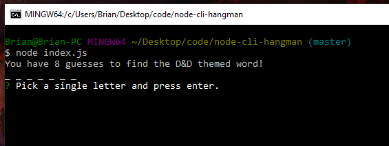
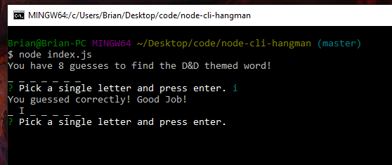
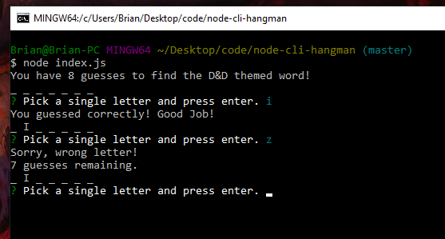
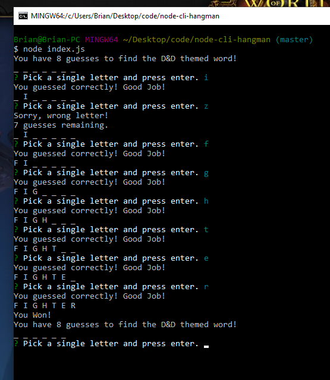

# node-cli-hangman
A simple, node.js app that allows the user to play hangman from the terminal.

## Table of Contents

* Application Overview/Use
* Technologies Used
* Application Details (How it works)
* Screenshots of application

## Application Overview/Use

This is a terminal application that utilizes node.js to run a hangman style game in the console. It utilizes the inquirer npm to prompt the user for data entry and checks their guess with an array of existing words to solve the puzzle. 

### Commands and instructions

* The app is initialized by navigating to the directory that contains the source files, and running the following command in the terminal: node index.js

* Upon initialization, the app notifies the user to input letters to guess the D&D themed word hangman style.

* If the user enters a valid letter, the app checks to see if the letter is located in the randomly chosen word, and if it is successful, then it displays the letter. If it is not correct, it decrements the remaining guesses and prompts the user again. 

* If the user runs out of guesses, they are given a game over prompt, shows the word, and the game is reset and starts over.

* If the user guesses the word, they are given a success prompt, and the game is reset and starts over. 

## Tech Used

* Javascript
* Node.js
* Inquirer npm
* Regular Expressions

## Application Details (How it works)

The application uses 3 javascript files. The letter.js file is the constructor to assemble and manage letters in the randomly chosen word. Word.js is the constructor to manage the data for the randomly chosen words. Index.js contains the primary logic to run the game and manage user prompting.

The game has a pre-built array of words, which it randomly chooses one from upon starting. It then prompts the user and displays the word as Underscores. It also logs the users guesses and shows how many guesses are remaining. It tracks the results and resets upon a win or a loss. 

Currently, there is an error that occurs on the 9th instance. This is a known error caused by inquirer that there isn't currenlty a solution that I could find. I was not able to successfully implement the setMaxListener command. This would need to be solved for long term use. If you continue entering items as usual, the program resumes operation. 

Reference to issue here: https://stackoverflow.com/questions/51713333/how-to-terminate-npm-inquirer-prompt-and-return-control-to-main-menu-function

## Screenshots

### Application Start up screenshot

### Correct Guess screenshot

### Incorrect Guess screenshot

### Success screenshot
